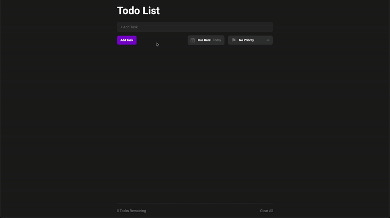

# Todo List
A responsive web-based todo list application that allows users to add tasks, set priorities and due dates, and saves all entries to local storage.

## Demo  

## Usage  
1. Visit the [GitHub Pages link](https://justinr25.github.io/todo-list/) or open `index.html` in your browser.  
2. Type a task into the main input field, and optionally select a **Due Date** and **Priority**.  
3. Click **Add Task** to add the new item to your list.
4. Click a task's checkbox to mark it complete, or use **Clear All** to remove all tasks from the list
